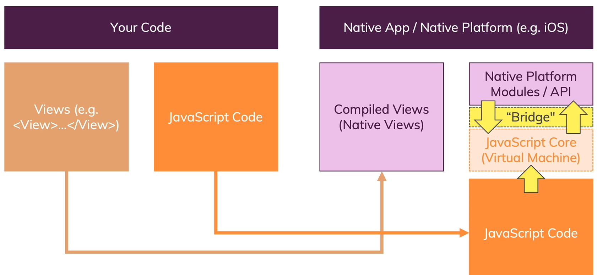
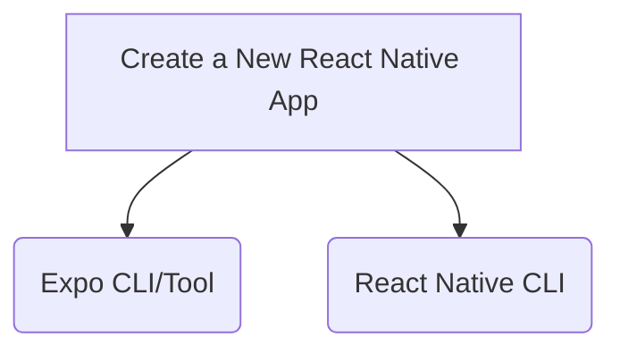
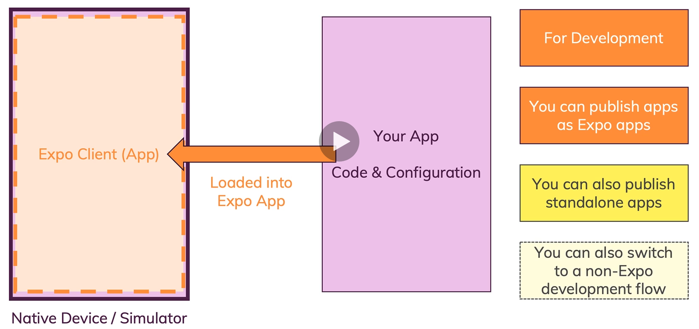
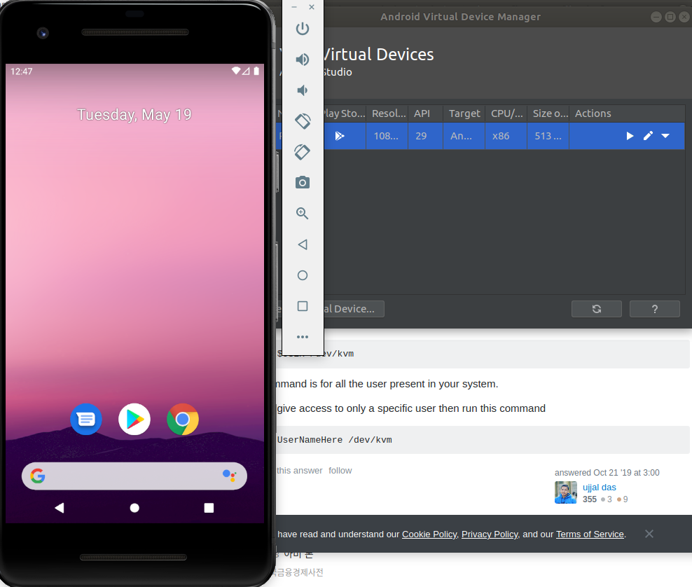
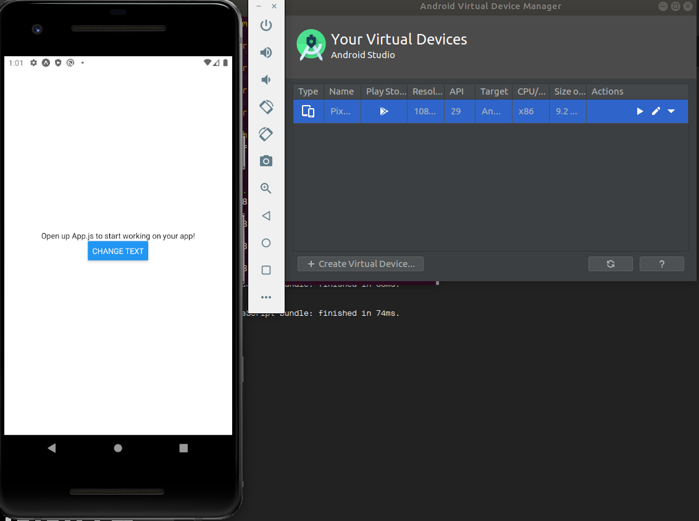
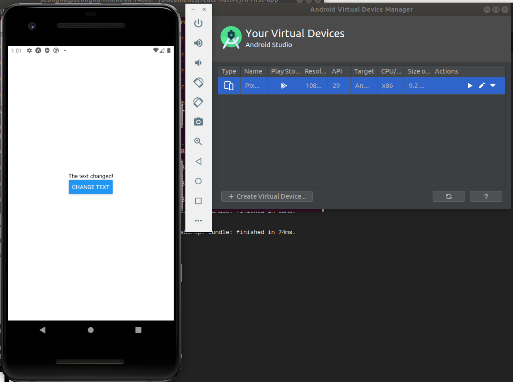

# React Native :smile:

## What is React Native

* React.js

    * A JavaScript Library for building User Interfaces
    * Typically used for Web Development
    * ReactDOM.render(...) adds the web support
    * React itself is Platform agnostic.

* React Native

    * A collection of "special React components"
    * Components compiled to Native Widgets
    * Native Platform APIs exposed to JavaScript 
    * Connect JavaScript and Native Platform Code

* React.js + React Native = Real Native Mobile Apps (iOS, Android)

## Behind the Scenes

React+ React Native App

```js
const App = props => {
    return (
        <View>
            <Text>Hello there!</Text>
        </View>
    )
}
```

-> compiled to (View are compiled!) -> Real Native App

## More details

|React for the Web|Native Component (Android)|Native Component(iOS)|React Native|
|---|---|---|---|
|```<div>```|android.view|UIView|```<View>```|
|```<input>```|EditText|UITextField|```<TextInput>```|
|...|...|...|...|

-> React Native maps re-usable components to the respective platform equivalents

## And the JavaScript part / our logic

|UI||Logic|
|---|---|---|
|Components exposed by React Native||Written by us, in JavaScript|
|||JavaScript thread hosted by React Native app|
|Compiled to native views||NOT compiled|

## A look behind the scenes



## Expor or React Native CLI

* Create a new [react native app](https://reactnative.dev/)



* Expo CLI/Tool
    * Third-Party Service (Free!)
    * "Managed App Development"
    * Lots of Convenience & Uitility Features: simplifies development
    * But: You're limited to the Expo Ecosystem
* React Native CLI
    * By React Native Team / Comminity
    * Bare-bone development (only a basic setup)
    * Almost no convenience or utility features
    * full flexibility: integrate with any native code

> note: We'll use Expo! You can switch("eject")

## How [Expo](https://expo.io/) works



## Creating the first React Native App

1. [node js](https://nodejs.org/en/) download and installation
2. Get the command line tool

```sh
npm install expo-cli --global
```

3. Create the first project

```sh
expo init rn-first-app
```

click the blank

```sh
cd rn-first-app
npm start
```

4. Open iPhone camera checking the QR code in order to connect EXPO app on iPhone

## React Native is a "Fast-Moving Target"

* New versions every month
* Breaking changes do happen
* High Dependency on thrid-party packages that also change
* Bugs / Workarounds required

## Requirements

* JavaScript + React Knowledge
* NO Android, Java, Swift or ObjectiveC Knowledge Required!

## Running the App on an Android Emulator

* Installing Java OpenJDK
Android Studio requires OpenJDK version 8 or above to be installed to your system.

We will install OpenJDK8. The instllation is quite simple, start by updating the package index:

```sh
sudo apt update
sudo apt install openjdk-8-jdk
```

Verify the installation

```sh
java -version
```

Install android studio

```sh
./studio.sh
code ~/.bashrc
```

Add a line like

```js
export ANDROID_SDK=/home/seongha/Android/sdk
```

Go to Terminal and source the updated .bashrc file

```sh
source ~/.bashrc
```

```sh
sudo chmod 777 -R /dev/kvm
```

set SDK manager

Click AVD manager





## Make shortcut

You can create a file "studio.desktop" in /usr/share/applications with the following contents

```sh
[Desktop Entry]
Name=Android Studio
Comment=Android Studio
Exec=/opt/android-studio/bin/studio.sh
Icon=/opt/android-studio/bin/studio.png
Terminal=false
Type=Application
Categories=Development
```

## Useful resources and links

* [Official Expo Docs](https://docs.expo.io/get-started/installation/?redirected)
* [Official React Native Docs](https://reactnative.dev/docs/getting-started)